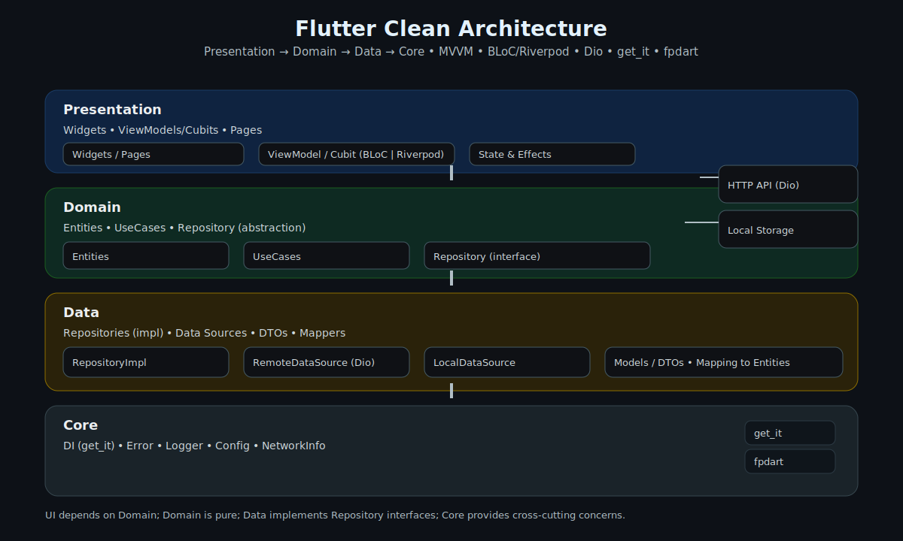

# Flutter Clean Architecture
<p align="center">
  
</p>


<p align="center">
  <i>MVVM + BLoC + Dio — a pragmatic, one-command Flutter scaffold for production-ready apps.</i>
</p>

<p align="center">
  
  <a href="https://github.com/Amir-beigi-84/flutter-clean-architecture/stargazers">
    
  </a>
  <a href="https://github.com/Amir-beigi-84/flutter-clean-architecture/issues">
    
  </a>
  
</p>

---

## Overview

This repository provides a clean, opinionated Flutter scaffold that follows **Clean Architecture** with **MVVM** and supports multiple state-management styles (**BLoC**, **Riverpod**, **Provider**, **GetX**). It includes dependency injection with `get_it`, HTTP networking via `dio`, functional helpers (`fpdart`), and code generation setup.

Search-intent terms covered: *flutter clean architecture*, *flutter mvvm*, *flutter bloc scaffold*, *flutter riverpod template*, *dio get_it architecture*.

---

## Quick Start

Create and scaffold a new app:

```bash
flutter create my_app && cd my_app
```

Run setup:

- **Windows (PowerShell)**
  ```powershell
  powershell -ExecutionPolicy Bypass -File scripts\setup-windows.ps1
  ```
- **macOS/Linux (Bash/Zsh)**
  ```bash
  chmod +x scripts/setup-unix.sh && scripts/setup-unix.sh
  ```
- **fish**
  ```bash
  chmod +x scripts/setup-fish.fish && fish scripts/setup-fish.fish
  ```

### Global command (recommended)

Install once and use in any project:

```bash
# macOS/Linux
chmod +x scripts/install-unix.sh && scripts/install-unix.sh

# Windows
powershell -ExecutionPolicy Bypass -File scripts\install-windows.ps1
```

Then scaffold:

```bash
flutter-clean --state riverpod --name "My App"
```

---

## Auto Mode

```bash
flutter-clean --auto
```
- Infers app name from `pubspec.yaml`
- Auto-selects state management if it finds `flutter_riverpod`, `provider`, or `get`
- Defaults to **BLoC** otherwise

---

## Options

### State management
- `bloc` (default)
- `riverpod`
- `provider`
- `getx`

### Router
- `--router go_router` → generates `lib/src/core/router/app_router.dart`
- `--router none` → default Navigator

### Profiles
- `--profile minimal` → essentials (DI, HTTP, chosen state lib)
- `--profile standard` → + connectivity + logging
- `--profile full` → + prefs, secure storage, fpdart, json_serializable, codegen

### Common flags
- `--skip-install` → write files only
- `--skip-codegen` → skip build_runner/formatting

---

## Structure

```
lib/src/
  core/
    di/
    error/
    network/
  features/
    todo/
      data/
      domain/
      presentation/
```

Included:
- DI via `get_it`
- Networking via `dio` + logging
- Functional core via `fpdart` + `equatable`
- Example feature: `todo` (domain/data/presentation)
- Material 3 baseline theme and a minimal gradient shell

---

## Example Code

### Entity
```dart
import 'package:equatable/equatable.dart';

class Todo extends Equatable {
  const Todo({required this.id, required this.title, required this.completed});
  final int id;
  final String title;
  final bool completed;
  @override
  List<Object?> get props => [id, title, completed];
}
```

### Use Case
```dart
import 'package:fpdart/fpdart.dart';
import '../../../../core/usecase/usecase.dart';
import '../../../../core/error/failures.dart';
import '../entities/todo.dart';
import '../repositories/todo_repository.dart';

class GetTodos implements UseCase<List<Todo>, NoParams> {
  GetTodos(this._repository);
  final TodoRepository _repository;
  @override
  Future<Either<Failure, List<Todo>>> call(NoParams params) => _repository.getTodos();
}
```

### Repository (interface)
```dart
import 'package:fpdart/fpdart.dart';
import '../../../../core/error/failures.dart';
import '../entities/todo.dart';

abstract class TodoRepository {
  Future<Either<Failure, List<Todo>>> getTodos();
}
```

### Repository (implementation)
```dart
import 'package:fpdart/fpdart.dart';
import '../../../../core/error/exceptions.dart';
import '../../../../core/error/failures.dart';
import '../../../../core/network/network_info.dart';
import '../../domain/entities/todo.dart';
import '../../domain/repositories/todo_repository.dart';
import '../datasources/todo_remote_data_source.dart';

class TodoRepositoryImpl implements TodoRepository {
  TodoRepositoryImpl({required this.remote, required this.networkInfo});
  final TodoRemoteDataSource remote;
  final NetworkInfo networkInfo;

  @override
  Future<Either<Failure, List<Todo>>> getTodos() async {
    if (!await networkInfo.isConnected) {
      return left(const NetworkFailure('No internet connection'));
    }
    try {
      final result = await remote.getTodos();
      return right(result);
    } on ServerException catch (e) {
      return left(ServerFailure(e.message));
    } catch (_) {
      return left(const ServerFailure('Unexpected error'));
    }
  }
}
```

### Cubit
```dart
import 'package:flutter_bloc/flutter_bloc.dart';
import '../../../../core/usecase/usecase.dart';
import '../../domain/entities/todo.dart';
import '../../domain/usecases/get_todos.dart';

sealed class TodoState {}
class TodoInitial extends TodoState {}
class TodoLoading extends TodoState {}
class TodoLoaded extends TodoState {
  TodoLoaded(this.items);
  final List<Todo> items;
}
class TodoError extends TodoState {
  TodoError(this.message);
  final String message;
}

class TodoCubit extends Cubit<TodoState> {
  TodoCubit(this._getTodos) : super(TodoInitial());
  final GetTodos _getTodos;

  Future<void> load() async {
    emit(TodoLoading());
    final res = await _getTodos(const NoParams());
    res.match(
      (l) => emit(TodoError(l.message)),
      (r) => emit(TodoLoaded(r)),
    );
  }
}
```

---

## Run

```bash
flutter run -d windows|macos|linux
```

---

## Repository hygiene and SEO

- Keep secrets out of Git (do not commit `.env` or keys). Use secure storage or CI secrets.
- Consider a CI workflow that runs `flutter analyze` and `flutter test` on pull requests.
- Use precise, searchable terms in headings and alt text: *Flutter Clean Architecture*, *MVVM*, *BLoC*, *Riverpod*, *Dio*.
- Add GitHub topics (Settings → About → Topics): `flutter`, `clean-architecture`, `bloc`, `riverpod`, `mvvm`, `dio`, `get_it`, `template`, `scaffold`.
- Keep the README concise and scannable; link out to in-depth docs as the project grows.

---

## License

[MIT](LICENSE)
