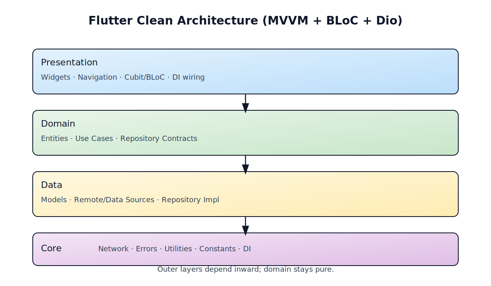

Flutter Clean Architecture

 
<p align="center">
  <em>MVVM + BLoC + Dio — a pragmatic, one-command Flutter scaffold.</em>
  <br/>
  
  <a href="https://github.com/Amir-beigi-84/flutter-clean-architecture/stargazers">
    
  </a>
  <a href="https://github.com/Amir-beigi-84/flutter-clean-architecture/issues">
    
  </a>
  
</p>

Quick Start

- Create app: `flutter create my_app && cd my_app`
- No copying needed. Run one of these from your project root:
  - Windows (PowerShell): `powershell -ExecutionPolicy Bypass -File scripts\\setup-windows.ps1`
  - macOS/Linux (Bash/Zsh): `chmod +x scripts/setup-unix.sh && scripts/setup-unix.sh`
  - fish: `chmod +x scripts/setup-fish.fish && fish scripts/setup-fish.fish`

Global Command (recommended)

- One-time install to PATH:
  - macOS/Linux: `chmod +x scripts/install-unix.sh && scripts/install-unix.sh`
  - Windows: `powershell -ExecutionPolicy Bypass -File scripts\install-windows.ps1`
  - fish (optional): `chmod +x scripts/install-fish.fish && fish scripts/install-fish.fish`

- Then use the global command from any Flutter project: `flutter-clean --state riverpod --name "My Beautiful App"`

Auto Mode

- Use `--auto` to infer sensible defaults from `pubspec.yaml`:
  - Detects app `name:` and sets display name automatically
  - Chooses state management if a dependency exists (`flutter_riverpod`, `provider`, `get`), defaults to `bloc`
  - Example: `flutter-clean --auto`

State Management Options

- The Unix script now lets you choose a state management style interactively or via flag:
  - `bloc` (default): `flutter_bloc` Cubit presentation
  - `riverpod`: `flutter_riverpod` with `StateNotifier`
  - `provider`: `provider` with `ChangeNotifier`
  - `getx`: `get` with `GetxController`

Router Option

- Choose navigation style interactively or via flag:
  - `--router go_router` to enable `go_router` and scaffold `lib/src/core/router/app_router.dart`
  - `--router none` to use standard Navigator and a `home:` page
  - In auto mode, the scripts detect `go_router` in `pubspec.yaml` and enable it.

Examples

- Interactive (shows a menu):
  - Windows: `powershell -ExecutionPolicy Bypass -File scripts\setup-windows.ps1`
  - Unix: `scripts/setup-unix.sh`
  - fish: `fish scripts/setup-fish.fish`
- Non-interactive with Riverpod:
  - Windows: `scripts\setup-windows.ps1 --state riverpod`
  - Unix: `scripts/setup-unix.sh --state riverpod`
  - fish: `scripts/setup-fish.fish --state riverpod`
- With go_router enabled:
  - Windows: `scripts\setup-windows.ps1 --state bloc --router go_router`
  - Unix: `scripts/setup-unix.sh --state bloc --router go_router`
  - Global: `flutter-clean --state bloc --router go_router`
- Set app display name:
  - Windows: `scripts\setup-windows.ps1 --state bloc --name "My Beautiful App"`
  - Unix: `scripts/setup-unix.sh --state bloc --name "My Beautiful App"`
  - fish: `scripts/setup-fish.fish --state bloc --name "My Beautiful App"`
  - With global command: `flutter-clean --state bloc --name "My Beautiful App"`

Fast Profiles and Flags

- `--profile minimal|standard|full` (default: `standard`)
  - `minimal`: installs only essentials (DI, HTTP, chosen state lib) — fastest
  - `standard`: adds connectivity + logging
  - `full`: adds prefs, secure storage, fpdart, json_serializable, and codegen
- `--skip-install`: writes files only, you can add packages later
- `--skip-codegen`: skips `build_runner` and formatting steps

GitHub Best Practices

- Initialize and push your project repository:
  - `git init`
  - `git add . && git commit -m "chore: scaffold clean architecture"`
  - Create a new repo on GitHub, then:
    - `git remote add origin https://github.com/<you>/<repo>.git`
    - `git branch -M main && git push -u origin main`
- Keep secrets out of Git:
  - Do not commit `.env` or any API keys; prefer platform-specific secure storage or CI secrets.
- CI (optional but recommended):
  - Add a simple workflow to run `flutter analyze` and `flutter test` on PRs.

What You Get

- Batteries-included deps: `get_it`, `flutter_bloc`, `dio`, `fpdart`, `equatable`, `connectivity_plus`, `json_*`.
- Clean layers under `lib/src/` with a sample `todo` feature.
- DI setup (`get_it`), `Dio` client + logging, `build_runner` codegen.
- Minimal `main.dart` bootstrap and opinionated lints.

Run

- `flutter run -d windows|macos|linux` (or any device)

Stack

- Architecture: MVVM + Clean layers
- State: `flutter_bloc` | `flutter_riverpod` | `provider` | `get`
- Networking: `dio` + `pretty_dio_logger`
- DI: `get_it`
- Functional core: `fpdart`

Why

- Ship a clean baseline fast without yak-shaving.
- Consistent structure for multi-feature apps.
- Easy to tear out or extend pieces as you go.

Screenshots

<p align="center">
  
</p>

- Todo List (Light): `docs/screenshots/todo_list_light.png`
- Todo List (Dark): `docs/screenshots/todo_list_dark.png`

Tip: Drop your real screenshots into `docs/screenshots/` with the names above to render them here automatically.

Notes

- All scripts include a polished Material 3 theme and a gradient background shell around the main Scaffold for a clean, modern look.

Code Snippets

Entity

```dart
// lib/src/features/todo/domain/entities/todo.dart
import 'package:equatable/equatable.dart';

class Todo extends Equatable {
  const Todo({required this.id, required this.title, required this.completed});
  final int id;
  final String title;
  final bool completed;
  @override
  List<Object?> get props => [id, title, completed];
}
```

Use Case

```dart
// lib/src/features/todo/domain/usecases/get_todos.dart
import 'package:fpdart/fpdart.dart';
import '../../../../core/usecase/usecase.dart';
import '../../../../core/error/failures.dart';
import '../entities/todo.dart';
import '../repositories/todo_repository.dart';

class GetTodos implements UseCase<List<Todo>, NoParams> {
  GetTodos(this._repository);
  final TodoRepository _repository;
  @override
  Future<Either<Failure, List<Todo>>> call(NoParams params) => _repository.getTodos();
}
```

Repository

```dart
// lib/src/features/todo/domain/repositories/todo_repository.dart
import 'package:fpdart/fpdart.dart';
import '../../../../core/error/failures.dart';
import '../entities/todo.dart';

abstract class TodoRepository {
  Future<Either<Failure, List<Todo>>> getTodos();
}
```

Repository Impl

```dart
// lib/src/features/todo/data/repositories/todo_repository_impl.dart
import 'package:fpdart/fpdart.dart';
import '../../../../core/error/exceptions.dart';
import '../../../../core/error/failures.dart';
import '../../../../core/network/network_info.dart';
import '../../domain/entities/todo.dart';
import '../../domain/repositories/todo_repository.dart';
import '../datasources/todo_remote_data_source.dart';

class TodoRepositoryImpl implements TodoRepository {
  TodoRepositoryImpl({required this.remote, required this.networkInfo});
  final TodoRemoteDataSource remote;
  final NetworkInfo networkInfo;

  @override
  Future<Either<Failure, List<Todo>>> getTodos() async {
    if (!await networkInfo.isConnected) {
      return left(const NetworkFailure('No internet connection'));
    }
    try {
      final result = await remote.getTodos();
      return right(result);
    } on ServerException catch (e) {
      return left(ServerFailure(e.message));
    } catch (_) {
      return left(const ServerFailure('Unexpected error'));
    }
  }
}
```

Cubit (Presentation)

```dart
// lib/src/features/todo/presentation/cubit/todo_cubit.dart
import 'package:flutter_bloc/flutter_bloc.dart';
import '../../../../core/usecase/usecase.dart';
import '../../domain/entities/todo.dart';
import '../../domain/usecases/get_todos.dart';

sealed class TodoState {}
class TodoInitial extends TodoState {}
class TodoLoading extends TodoState {}
class TodoLoaded extends TodoState { TodoLoaded(this.items); final List<Todo> items; }
class TodoError extends TodoState { TodoError(this.message); final String message; }

class TodoCubit extends Cubit<TodoState> {
  TodoCubit(this._getTodos) : super(TodoInitial());
  final GetTodos _getTodos;

  Future<void> load() async {
    emit(TodoLoading());
    final res = await _getTodos(const NoParams());
    res.match(
      (l) => emit(TodoError(l.message)),
      (r) => emit(TodoLoaded(r)),
    );
  }
}
```

Bootstrap

```dart
// lib/main.dart
import 'package:flutter/material.dart';
import 'package:flutter_bloc/flutter_bloc.dart';
import 'src/core/di/injection.dart';
import 'src/features/todo/presentation/cubit/todo_cubit.dart';
import 'src/features/todo/domain/usecases/get_todos.dart';

Future<void> main() async {
  WidgetsFlutterBinding.ensureInitialized();
  await configureDependencies();
  runApp(const MyApp());
}

class MyApp extends StatelessWidget {
  const MyApp({super.key});
  @override
  Widget build(BuildContext context) {
    return MaterialApp(
      title: 'Clean MVVM App',
      home: BlocProvider(
        create: (_) => TodoCubit(sl<GetTodos>())..load(),
        child: const Scaffold(
          appBar: AppBar(title: Text('Todos')),
          body: Center(child: Text('…')), // Replace with your UI
        ),
      ),
    );
  }
}
```
